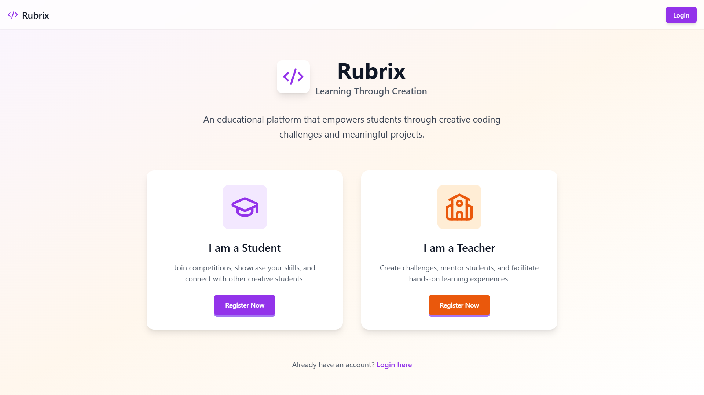
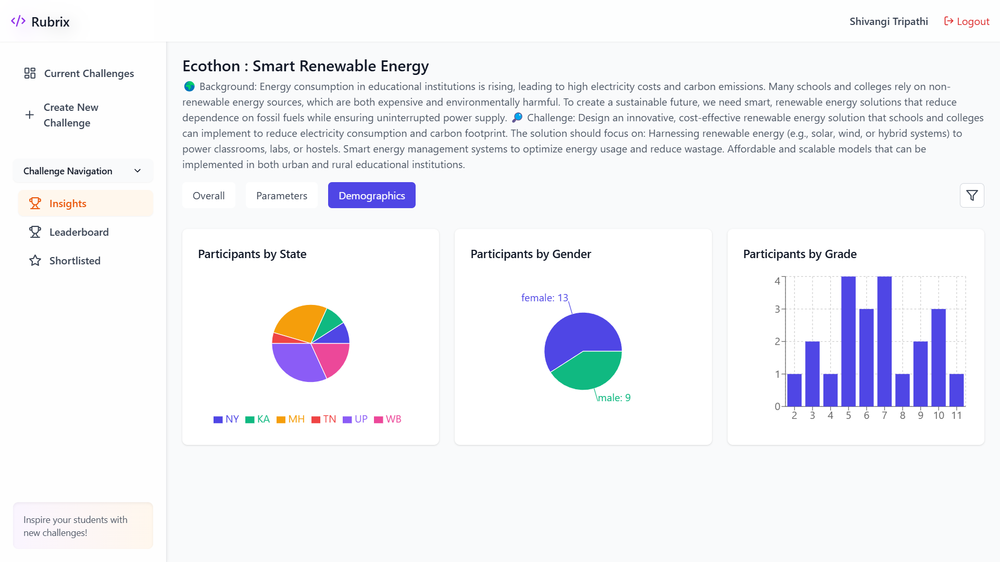
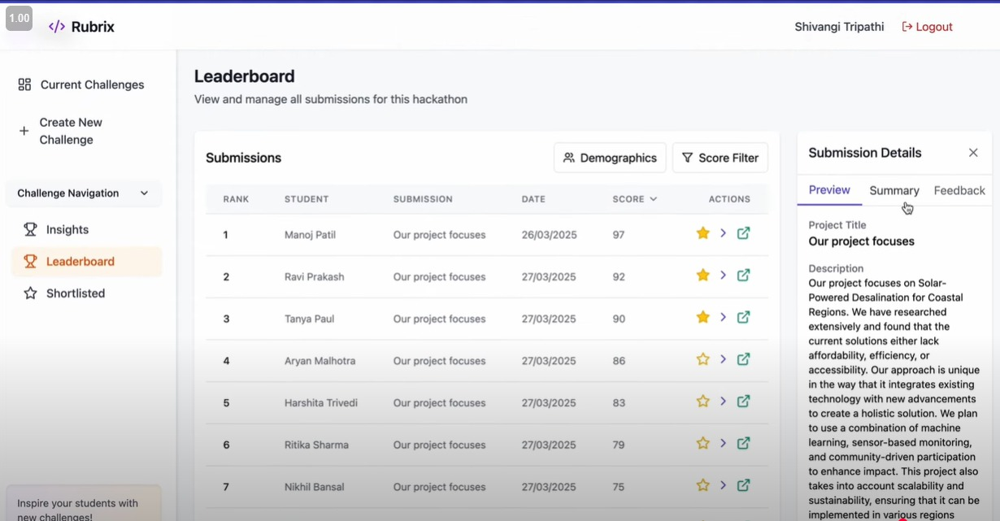
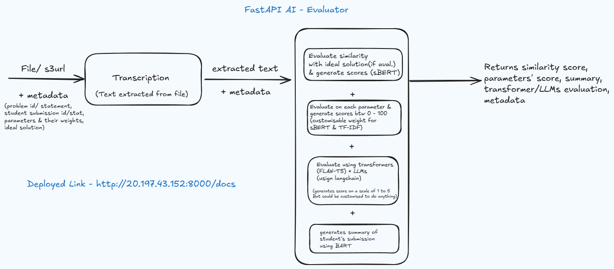
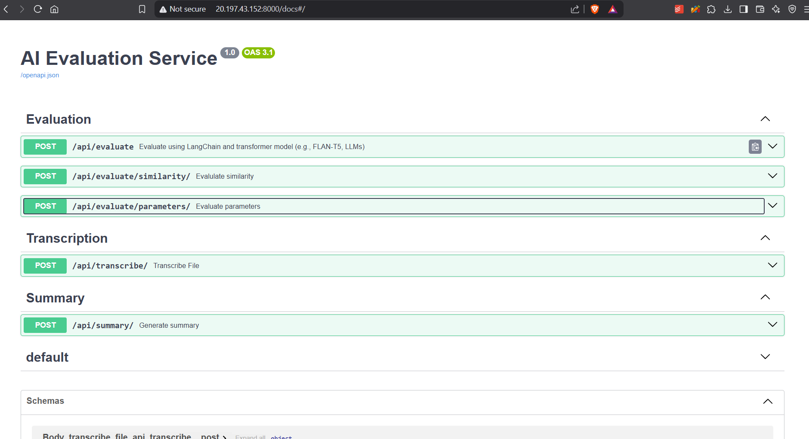
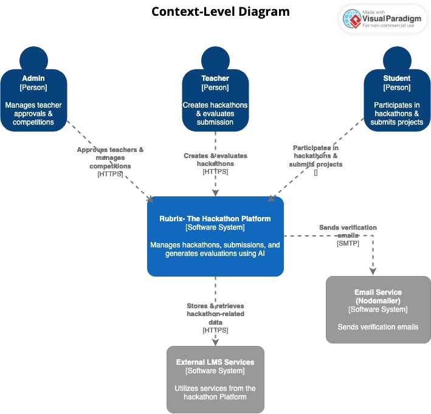
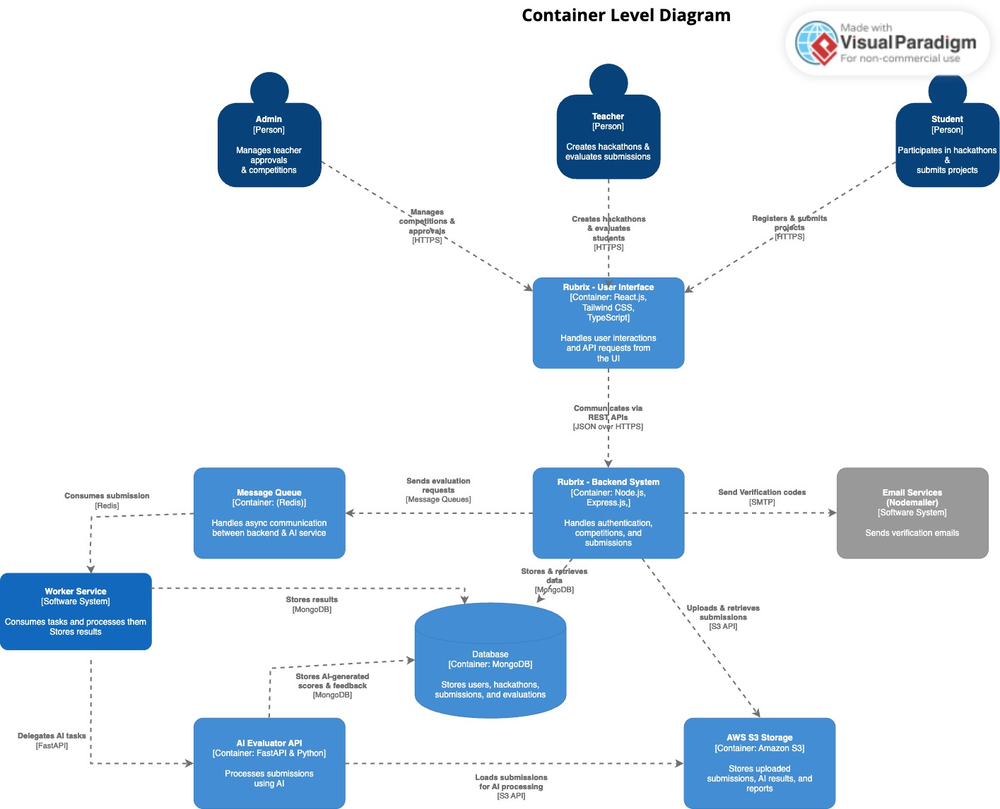
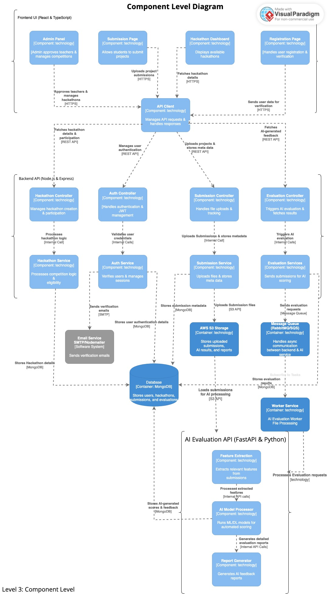

# Rubrix : Advanced Hackathon Management Platform

Rubrix is a comprehensive, AI-powered hackathon management platform designed for the world's most honored hackathons. It enables students to participate in coding challenges while providing teachers powerful tools to create, manage, and automatically evaluate submissions using state-of-the-art AI technologies.

## 🚀 System Architecture

Rubrix utilizes a modern microservices architecture with five key components:

1. **Frontend**: React/TypeScript application providing an intuitive UI for both students and teachers
2. **Backend**: Express.js API server handling core business logic, authentication, and data management
3. **Micro Service**: FastAPI-based AI evaluation engine for semantic analysis and submission processing
4. **Worker**: Asynchronous job processor connecting the backend and micro service via Redis queues
5. **AI Evaluator**: Advanced machine learning service providing detailed assessment of submissions

## 🔗 Links & Images

[Demo Video](https://www.youtube.com/watch?v=jDF60U8n-lI)  
[AI Evaluator Video](https://www.youtube.com/watch?v=7UK-cMFd2So)  
[Context, Container, Component Level Diagram (Google Drive)](https://drive.google.com/drive/folders/1k30jOi6NEXNbbQI97TGeks7KgcuzrV5e?usp=drive_link)

|  |  |  |  |
|--------------------------------------|------------------------------------|-------------------------------------------|-------------------------------|
|  |  |  |  |


## ✨ Key Features

### For Students
- Register and create personalized student accounts
- Join hackathons through unique access codes or open registration
- Submit projects with multiple file formats (code, documents, presentations, audio, video)
- Track submission status with real-time processing updates
- Receive AI-generated feedback and evaluation scores

### For Teachers/Organizers
- Create and customize hackathons with flexible parameters
- Control access through multiple eligibility criteria
  - Grade-based access
  - School-based access
  - Region/state-based access
  - Code-only access with unique invite codes
- Set custom evaluation parameters and weightings
- Review AI-evaluated submissions with detailed insights
- Shortlist promising submissions for final review
- Access comprehensive leaderboards and analytics

## 🧠 AI Capabilities

### Multi-Format Submission Analysis
- **Semantic Text Analysis**: Evaluates submissions using SBERT models with support for 50+ languages
- **Automatic Code Evaluation**: Assesses code quality, structure, and functionality
- **File Transcription**: Extracts text from various file formats:
  - Documents (PDF, DOCX, TXT)
  - Images (JPG, PNG)
  - Audio (MP3, WAV, M4A)
  - Video (MP4, AVI, MOV)

### Advanced Evaluation Features
- **Parameter-Based Assessment**: Customizable evaluation criteria with weighted scoring
- **Comparative Analysis**: Benchmarks submissions against problem statements
- **Semantic Similarity**: Measures relevance using advanced NLP techniques
- **Summary Generation**: AI-generated summaries of complex submissions
- **Multilingual Support**: Processes and evaluates content in 50+ languages

## 🔐 Security & Access Control
- JWT-based authentication with role-specific permissions
- Secure file storage with AWS S3 and access management
- Code-based access control for private hackathons
- Role-based visibility of sensitive information
- MongoDB for secure data persistence

## 🛠️ Technical Stack

### Frontend
- React with TypeScript
- React Router for navigation
- TailwindCSS for responsive styling
- React Hook Form for form handling
- Recharts for data visualization

### Backend
- Node.js and Express
- MongoDB with Mongoose ODM
- Redis for queue management
- JWT for authentication
- AWS S3 for file storage

### Micro Service
- Python with FastAPI
- SBERT for semantic text analysis
- Whisper for audio/video transcription
- PyTesseract for image OCR
- MongoDB for storing evaluation results

### Worker
- Node.js for asynchronous processing
- Redis for message queuing
- Axios for service communication

### AI Evaluator
- FastAPI framework
- Hugging Face transformers
- SBERT embeddings
- LangChain for evaluation workflows
- BART for text summarization

## 📊 Data Flow Architecture

1. **Submission Flow**:
   - Student submits code/files via the frontend
   - Backend validates and stores submission in MongoDB
   - File attachments are uploaded to S3
   - Submission details are added to Redis queue
   - Worker processes queue items and sends to micro service
   - Micro service performs AI evaluation and returns results
   - Results are stored in MongoDB and delivered to frontend

2. **Evaluation Flow**:
   - Teacher sets evaluation parameters when creating a hackathon
   - Micro service analyzes submissions against these parameters
   - Each parameter receives a semantic similarity score
   - Weighted scores are combined for final evaluation
   - Teachers can review, override, or accept AI evaluations

## 🔄 API Endpoints

### Authentication
- `POST /api/auth/register/student` - Register a student
- `POST /api/auth/register/teacher` - Register a teacher
- `POST /api/auth/login` - Login
- `GET /api/auth/logout` - Logout
- `GET /api/auth/me` - Get current user

### Hackathons
- `GET /api/hackathons` - Get all hackathons (for teachers) or joined hackathons (for students)
- `GET /api/hackathons/completed` - Get completed hackathons
- `GET /api/hackathons/:id` - Get a specific hackathon
- `POST /api/hackathons` - Create a hackathon
- `PUT /api/hackathons/:id` - Update a hackathon
- `DELETE /api/hackathons/:id` - Delete a hackathon
- `POST /api/hackathons/:id/collaborators` - Add collaborators
- `POST /api/hackathons/:id/participants` - Register participants
- `GET /api/hackathons/:id/participants` - Get participants list
- `GET /api/hackathons/:id/leaderboard` - Get leaderboard
- `GET /api/hackathons/:id/submissions` - Get all submissions
- `GET /api/hackathons/:id/shortlisted` - Get shortlisted submissions
- `POST /api/hackathons/join-by-code` - Join a hackathon using a unique code (student exclusive)

### Submissions
- `POST /api/submissions` - Create a submission
- `GET /api/submissions/:id` - Get a submission
- `PUT /api/submissions/:id` - Evaluate a submission
- `POST /api/submissions/:id/shortlist` - Toggle shortlist status

### AI Evaluation
- `POST /api/transcribe/` - Extract text from uploaded files
- `POST /api/transcribe_s3/` - Transcribe files from S3
- `POST /api/transcribe_and_evaluate/` - Transcribe and evaluate submission
- `GET /api/evaluation/{submission_id}` - Get evaluation results
- `GET /api/hackathon/{hackathon_id}/evaluations` - Get all hackathon evaluations
- `GET /api/hackathon/{hackathon_id}/statistics` - Get hackathon statistics
- `POST /api/evaluate/parameters/` - Evaluate submission on multiple parameters

## 🚀 Deployment

Rubrix is containerized using Docker for easy deployment:

```bash
# Clone the repository
git clone <repository-url>
cd rubrix

# Start all services with Docker Compose
docker-compose up -d
```

This starts:
- Frontend on port 5173
- Backend on port 5001
- Micro service on port 8000
- Redis for queue management
- MongoDB for data persistence

## 💻 Local Development Setup

### Prerequisites
- Node.js (v14 or later)
- Python 3.9 or later
- MongoDB (local or Atlas)
- Redis server
- FFmpeg and Tesseract OCR

### Installation Steps

1. **Clone the repository**
```bash
git clone <repository-url>
cd rubricx
```

2. **Set up Backend**
```bash
cd backend
npm install
cp .env.example .env
# Configure environment variables
npm run dev
```

3. **Set up Frontend**
```bash
cd ../frontend
npm install
npm run dev
```

4. **Set up Micro Service**
```bash
cd ../micro
python -m venv venv
source venv/bin/activate  # On Windows: venv\Scripts\activate
pip install -r requirements.txt
cp .env.example .env
# Configure environment variables
uvicorn main:app --reload
```

5. **Set up Worker**
```bash
cd ../worker
npm install
cp .env.example .env
# Configure environment variables
npm run dev
```

## 🌟 Competitive Advantages

- **Full Automation**: End-to-end automated workflow from submission to evaluation
- **Multilingual Support**: Processes and evaluates content in 50+ languages
- **Multi-Format Analysis**: Handles various file types including code, documents, audio, and video
- **Customizable Evaluation**: Tailor evaluation parameters to specific hackathon needs
- **Real-time Processing**: Asynchronous worker architecture ensures responsive performance
- **Semantic Understanding**: Advanced NLP models provide deep insight into submissions
- **Scalable Architecture**: Microservices design allows for easy scaling of individual components

## 📄 License
MIT

---

© 2023 Rubrix | The Ultimate Hackathon Management Platform 