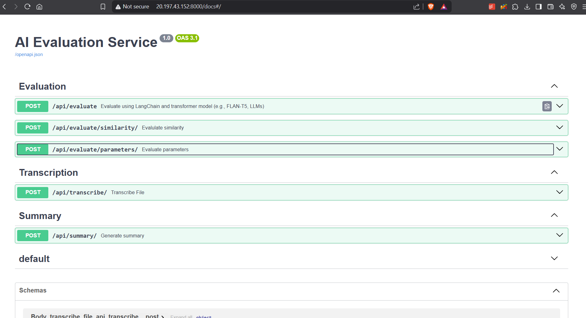

### Hack Score : Built for AI-powered Hackathon Evaluations!

[Deployed Link](http://20.197.43.152:8000/docs) - http\://20.197.43.152:8000/docs

## 📌 Overview

**AI Evaluator** is a FastAPI-based backend designed to evaluate hackathon submissions by:

- **Transcribing multi-format files including audio, video, docx, pdf, images, and more**
- **Evaluating similarity** with ideal solutions
- **Scoring based on multiple parameters** (e.g., relevance, impact, clarity)
- **Summarizing the submission** using NLP models
- **Generalized evaluation using LangChain and Transformer-based models**

This backend uses **LangChain, Hugging Face Transformers, and Whisper AI** for intelligent evaluation.

---



## ⚙️ Features

- **Transcription**: Converts multi-format files(audio, video, pdf, etc.) into text.
- **Evaluation**: Supports multiple evaluation methods:
  1. **Similarity Matching**: Computes cosine similarity between student submission and ideal solution (if provided) using SBERT.
  2. **Parameter-Based Scoring**: Uses SBERT + TF-IDF with customizable weights to evaluate submissions based on given parameters.
  3. **Transformer/LLM-Based Evaluation**: Uses LangChain with FLAN-T5 (or any other transformer model) to evaluate on **any criteria** based on a user-defined prompt. This enables evaluation on **anything the user wants**.
- **Summary Generation**: Creates concise summaries of submissions using **BART**.
- **Modular API Endpoints**: Users can selectively call individual endpoints instead of running all steps at once.
- **Dockerized**: Ready for deployment on AWS or any cloud platform.

---

## 🏰️ Project Structure

```
ai-evaluator/
│-- models/                   # Preloaded AI models (Whisper, SBERT, BART, etc.)
│-- routes/                   # FastAPI route handlers
│   ├── transcribe.py         # File transcription API
│   ├── evaluate.py           # Submission evaluation API
│   ├── summary.py            # Summarization API
│-- services/                 # Core AI logic
│   ├── transcription.py      # Handles speech-to-text conversion
│   ├── evaluate_similarity.py # Cosine similarity & SBERT embedding
│   ├── evaluate_parameters.py # Multi-criteria scoring
│   ├── langchain_evaluation.py # Uses FLAN-T5 for AI-assisted evaluation
│   ├── summariser.py         # Generates summaries using BART
│-- main.py                   # FastAPI entry point
│-- config.py                 # Configuration settings
│-- requirements.txt          # Dependencies
│-- Dockerfile                # Docker container setup
│-- README.md                 # Project documentation
```

---

## 🔧 Setup & Installation

### Prerequisites

1. Python 3.10 or higher (3.12 recommended)
2. pip (Python package manager)
3. Virtual environment (recommended)
4. Tesseract OCR installed on system
5. FFmpeg installed on system

### 1️⃣ Clone the Repository

```bash
git clone https://github.com/rajanraj2/PiJam_Team_9.git
cd ai-evaluator
```

### 2️⃣ Install Dependencies

```bash
pip install -r requirements.txt
```

### 3️⃣ (Optional) Create and Activate Virtual Environment

```bash
# Windows
python -m venv venv
.\venv\Scripts\activate

# Linux/Mac
python3 -m venv venv
source venv/bin/activate
```

### 4️⃣ Run the FastAPI Server

```bash
# Development mode with auto-reload
uvicorn main:app --reload --host 0.0.0.0 --port 8000

# Production mode
uvicorn main:app --host 0.0.0.0 --port 8000
```

📌 API will be available at: `http://127.0.0.1:8000/docs`

- Interactive API docs (Swagger UI) at `http://localhost:8000/docs`
- Alternative API docs (ReDoc) at `http://localhost:8000/redoc`

---

## 💼 Running with Docker

### 1️⃣ Build the Docker Image

```bash
docker build -t ai-evaluator .
```

### 2️⃣ Run the Container

```bash
docker run -p 8000:8000 ai-evaluator
```

### 3️⃣ Check Running Containers

```bash
docker ps
```

---

## 🚀 Deployment

### **AWS Lambda (via AWS Fargate or API Gateway)**

- Package the FastAPI app using **AWS Lambda Layers**
- Deploy with **AWS Fargate** for containerized execution
- Use **API Gateway** to expose endpoints

---

## 💼 API Endpoints

| Endpoint                    | Method | Description                                                                                           |
| --------------------------- | ------ | ----------------------------------------------------------------------------------------------------- |
| `/`                         | `GET`  | Home endpoint to check if the API is running                                                          |
| `/api/transcribe/`          | `POST` | Transcribes audio/video/pdf/docx files                                                                |
| `/api/evaluate/`            | `POST` | Evaluates a submission based on any criteria using Langchain and Transformer-based models.            |
| `/api/evaluate/parameters/` | `POST` | Scores based on multiple parameters                                                                   |
| `/api/evaluate/similarity/` | `POST` | Computes cosine similarity with an ideal solution and provides a similarity score based on embeddings |
| `/api/summary/`             | `POST` | Generates a summary of the submission                                                                 |

📌 **Full API documentation** is available at `/docs` after running the server or it can be accessed from [Deployed Version](http://20.197.43.152:8000/docs) (http\://20.197.43.152:8000/docs).

---

## ⚡ Tech Stack

- **FastAPI** - Backend Framework
- **Hugging Face Transformers** - NLP Models
- **LangChain** - AI-powered evaluation
- **Sentence Transformers (SBERT)** - Similarity Scoring
- **Whisper AI** - Speech-to-text Transcription
- **Docker** - Containerization
- **AWS S3** - File Storage (optional)

---

## 🏗 Error Handling

All endpoints include proper error handling and return appropriate HTTP status codes:

- 200: Success
- 400: Bad Request
- 500: Internal Server Error

Error responses include a status and message field for better debugging.

## 💡 Development

- The API uses FastAPI's automatic OpenAPI documentation
- All endpoints are properly typed using Pydantic models
- Code follows PEP 8 style guidelines
- Modular architecture for easy maintenance and scaling
- Local model inference without external API dependencies

---

🛠 Open for contributions! Fork and submit a PR.
